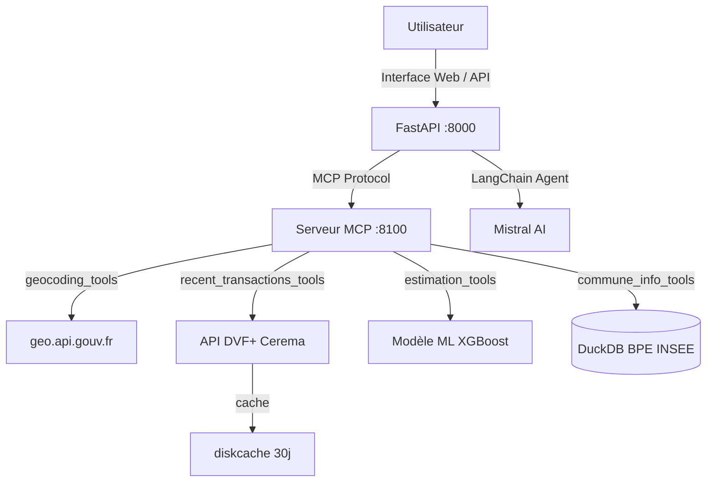
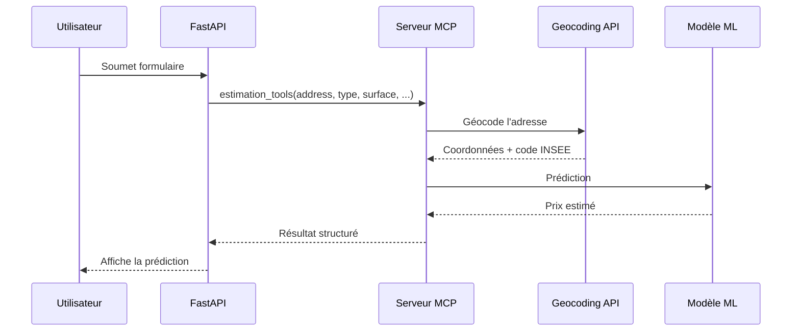
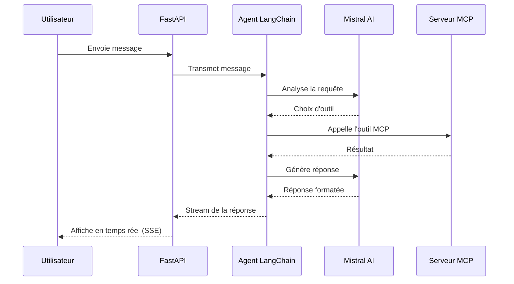

# Projet Immo - Prédiction de Prix Immobiliers

Application de prédiction du prix de biens immobiliers basée sur l'apprentissage automatique et un agent IA conversationnel.

## Description

Ce projet met à disposition une application permettant d'estimer le prix d'un bien immobilier en fonction de ses caractéristiques (localisation, surface, nombre de pièces, etc.). Il repose sur une architecture à deux services : une API FastAPI pour l'interface utilisateur et un serveur MCP (Model Context Protocol) exposant les outils métier (geocoding, transactions, estimation, équipements).

## Fonctionnalités

- Prédiction du prix d'un bien immobilier via un modèle XGBoost/Scikit-learn
- Interface web pour saisir les caractéristiques du bien
- Chatbot intelligent (Mistral AI) avec streaming pour l'assistance utilisateur
- Consultation des transactions immobilières récentes (API DVF+ Cerema)
- Consultation des équipements communaux (BPE INSEE via DuckDB)
- Geocoding d'adresses (geo.api.gouv.fr)
- Monitoring Prometheus + Grafana

## Architecture

Le projet suit une architecture microservices avec deux applications distinctes :



### Applications

| Service | Port | Description |
|---------|------|-------------|
| **FastAPI** | 8000 | API REST, interface web, chatbot, agent LangChain |
| **MCP Server** | 8100 | Outils métier : geocoding, transactions, estimation, équipements |

### Outils MCP

1. **geocoding_tools** : Conversion d'adresse en coordonnées GPS et code INSEE
2. **commune_info_tools** : Équipements de la commune (BPE INSEE)
3. **recent_transactions_tools** : Ventes immobilières récentes (API Cerema, cache disque 30 jours)
4. **estimation_tools** : Prédiction de prix (modèle XGBoost sérialisé)

## Technologies

- **Python 3.12** / **uv** : Gestion des dépendances
- **FastAPI** / **Uvicorn** : API REST et interface web
- **FastMCP** : Serveur MCP pour les outils métier
- **LangChain** / **Mistral AI** : Agent IA conversationnel
- **Scikit-learn** / **XGBoost** : Modèle de prédiction
- **DuckDB** : Base de données équipements INSEE
- **Prometheus** / **Grafana** : Monitoring
- **Docker** : Conteneurisation (multi-stage builds, groupes de dépendances)
- **K3S** : Orchestration Kubernetes
- **Ansible** : Déploiement automatisé
- **GitHub Actions** : CI/CD (tests, build, deploy)
- **DVC** : Versioning des données
- **MLflow** / **Optuna** : Entraînement et optimisation des modèles
- **LangSmith** : Monitoring de l'agent IA

## Installation

### Prérequis

- Python 3.12+
- uv
- make
- Un fichier `.env` (suivre `.env.exemple`)

### Étapes

```bash
# Cloner le dépôt
git clone https://github.com/cjeanneau/Projet-Agent-IA-Immo-MCP.git
cd Projet-Agent-IA-Immo-MCP

# Installer toutes les dépendances
uv sync --all-groups

# Ou installer uniquement pour un service
uv sync --group fastapi   # API uniquement
uv sync --group mcp       # MCP uniquement
```

## Utilisation

### Lancer les services localement

```bash
make fastapi    # Lance l'API FastAPI sur :8000
make fastmcp    # Lance le serveur MCP sur :8100
```

L'interface web est accessible à `http://localhost:8000` et la documentation API à `http://localhost:8000/docs`.

### Entraîner un modèle

```bash
python -m scripts.model_training_mlflow
```

### Lancer les tests

```bash
make test
make coverage-report
```

## Déploiement

### Docker

Les Dockerfiles utilisent des builds multi-stage et des groupes de dépendances uv pour des images optimisées :

```bash
# Construire les images
make build       # Image FastAPI (~330 MB)
make build-mcp   # Image MCP (~1.25 GB)

# Lancer les conteneurs
make run         # Lance FastAPI
make run-mcp     # Lance MCP
```

### K3S (Kubernetes)

```bash
# Importer les images dans k3s
make k3s

# Créer les secrets
make k3s-secrets

# Déployer les manifests
make deploy
```

### CI/CD (GitHub Actions)

- **tests.yml** : Tests automatiques sur push `main` et `staging`
- **build.yml** : Build et push des images Docker vers GHCR sur push `main`
- **deploy.yml** : Déploiement automatique sur K3S via Ansible après un build réussi

## Structure du projet

```
Projet-Agent-IA-Immo-MCP/
├── config.py              # Configuration (chemins, BDD, modèle)
├── config_agent.py        # Configuration LLM (Mistral AI)
├── pyproject.toml         # Dépendances par groupes (fastapi, mcp, dev)
├── Makefile               # Commandes courantes
├── ansible_playbook.yml   # Playbook de déploiement K3S
├── docker/
│   ├── Dockerfile.api     # Image FastAPI (multi-stage)
│   └── Dockerfile.mcp    # Image MCP (multi-stage)
├── k8s/
│   ├── fastapi-app.yaml   # Manifest Kubernetes FastAPI
│   └── mcp-server.yaml   # Manifest Kubernetes MCP
├── src/
│   ├── app/               # Application FastAPI
│   │   ├── main.py        # Point d'entrée
│   │   ├── routes.py      # Routes (predict, chat, chatbot)
│   │   ├── monitoring/    # Métriques Prometheus
│   │   └── templates/     # Templates HTML (Jinja2)
│   ├── agents/            # Client et agent MCP (LangChain)
│   │   ├── clientMCP.py   # Connexion au serveur MCP
│   │   └── agentMCP.py    # Création de l'agent
│   ├── mcp/               # Serveur MCP
│   │   ├── serverMCP.py   # Point d'entrée FastMCP
│   │   └── tools/         # Outils (geocoding, transactions, estimation, commune)
│   ├── inference/         # Logique de prédiction (model.py)
│   └── utils/             # Utilitaires (geo, chargement modèles)
├── scripts/               # Scripts (entraînement, nettoyage, déploiement)
├── notebooks/             # Notebooks d'exploration (Marimo)
├── tests/                 # Tests unitaires et d'intégration
├── monitoring/            # Dashboard Grafana
├── docs/                  # Documentation (benchmark, note de cadrage)
├── data/                  # Données (DVF, BPE INSEE DuckDB)
├── model/                 # Modèles entraînés
└── .github/workflows/     # CI/CD (tests, build, deploy)
```

## Données

Le projet utilise deux sources de données principales :

1. **Données DVF** (API DVF+ Cerema) : Transactions immobilières des 5 dernières années, interrogées en temps réel via l'API avec pagination asynchrone et cache disque (TTL 30 jours).

2. **Base Permanente des Équipements (BPE INSEE)** : Équipements par commune (écoles, commerces, infrastructures), stockés localement dans une base DuckDB.

Sources :
- [API Cerema DVF](https://www.data.gouv.fr/fr/datasets/demandes-de-valeurs-foncieres/)
- [BPE INSEE](https://www.insee.fr/fr/metadonnees/source/operation/s2216/presentation)

## Flux de Prédiction



## Flux du Chatbot



## Configuration

- `config.py` : Chemins des données, modèle, base DuckDB
- `config_agent.py` : Configuration du LLM Mistral AI (avec retry et compatibilité MCP)
- `.env` : Clés API (MISTRAL_API_KEY, LANGSMITH_*)

## Monitoring

- **Prometheus** : Métriques exposées sur `/metrics` (latence d'inférence)
- **Grafana** : Dashboard préconfigré dans `monitoring/grafana_dashboard.json`
- **LangSmith** : Tracing de l'agent IA sur https://eu.smith.langchain.com

## License

Ce projet est sous licence MIT - voir le fichier [LICENSE](LICENSE) pour plus de détails.
